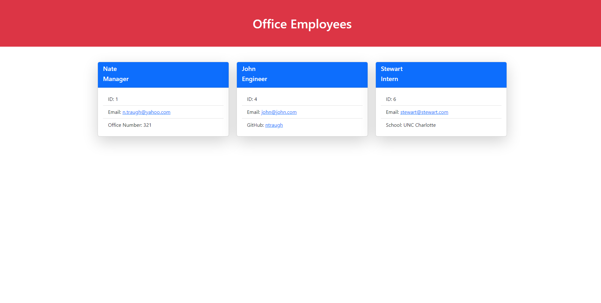

# Office-Employees

## Table of Contents
[Description](#Description)

[Usage](#Usage)

[Visuals](#Visuals)

[Resources](#resources)

## Description

- Click on the image below to see the walkthrough of the application
- Created a command line application to create an HTML page based off the users input.
- User can input all the information they would like about office employees and the application will dynamically create cards for each employee.

## Usage
- Invoke the program using node index.js
- Answer each prompt as it is given to you.
- At any point you may select the done building team option to have the HTML generated for you.

# Visuals

# Resources

[Repository](https://github.com/ntraugh/Office-Employees)